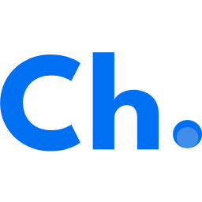
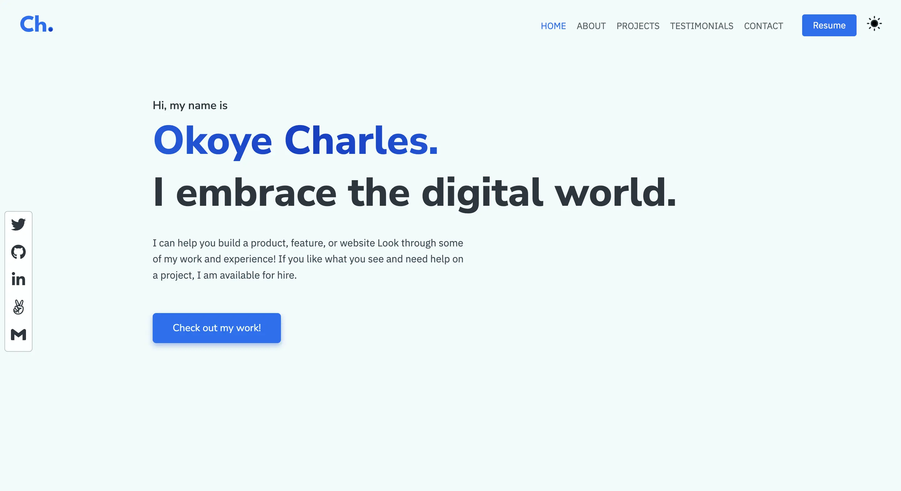

<a name="readme-top"></a>

<!-- PROJECT LOGO -->
<br />
<div align="center">
  <a href="https://okoyecharles-v2.vercel.app">
    
  </a>


  <h5 align="center">  
    <br />
    <a href="https://okoyecharles-v2.vercel.app" target="_blank">View Live</a>
    ·
    <a href="https://github.com/OkoyeCharles/portfolio-v2/issues/new" target="_blank">Report Bug</a>
    ·
    <a href="https://github.com/OkoyeCharles/portfolio-v2/issues/new" target="_blank">Request Feature</a>
  </h5>
</div>

<!-- TABLE OF CONTENTS -->
<details>
  <summary>Table of Contents</summary>
  <ol>
    <li>
      <a href="#my-portfolio">My Portfolio</a>
      <ul>
        <li><a href="#live-link">Live Link</a></li>
        <li><a href="#built-with">Built With</a></li>
      </ul>
    </li>
    <li>
      <a href="#getting-started">Getting Started</a>
      <ul>
        <li><a href="#clone-locally">Clone Locally</a></li>
        <li><a href="#prerequisites">Prerequisites</a></li>
        <li><a href="#testing">Testing</a></li>
      </ul>
    </li>
    <li><a href="#contributing">Contributing</a></li>
    <li><a href="#license">License</a></li>
    <li><a href="#contact">Contact</a></li>
    <li><a href="#acknowledgments">Acknowledgments</a></li>
  </ol>
</details>

<!-- ABOUT THE PROJECT -->

### My Portfolio

This website serves as a collection of my most recent, expertly crafted, and innovative projects as well as a base of knowlegde concerning the abouts of the creator... **Okoye Charles**.

<div align="center">
  
</div>

<p align="right">(<a href="#readme-top">back to top</a>)</p>

### Live link
Here is the [live link](https://okoyecharles-v2.vercel.app) of my portfolio.

### Built With

**Main Technologies:**

- 
- 
- 
- 

<p align="right">(<a href="#readme-top">back to top</a>)</p>

<!-- GETTING STARTED -->

## Getting Started

### Clone-Locally

- Enter this url: [https://github.com/okoyecharles/portfolio-v2](https://github.com/OkoyeCharles/portfolio-v2) in your web browser.
- Once opened navigate to the top left level of the project a green code download button will be visible on the righthand side.
- Select download Zip option from drop down menu.
- Once the download is complete you will be able to access my project locally.

### Prerequisites

- Node package manager (latest version)
  - Firstly install **node.js** then run the code below
  ```sh
  npm install npm@latest -g
  ```
- Project dependencies
  - Install all dependencies for running the project
  ```sh
  npm install
  ```

### Testing

In order to run tests for this project make sure you have installed all previously mentioned [prerequisites](#prerequisites) section, then run the code below.

- Run all tests
  - This should run all tests using 'react-test-renderer'
  ```sh
  npm run test
  ```
- Get a coverage report
  - Add a `--coverage` flag to the test script in [package.json](package.json).
  ```json
  "scripts": {
    ...
    "test": "react-scripts test --coverage",
  }
  ```

<p align="right">(<a href="#readme-top">back to top</a>)</p>

<!-- CONTRIBUTING -->

## Contributing

Contributions are what make the open source community such an amazing place to learn, inspire, and create. Any contributions you make are **greatly appreciated**.

If you have a suggestion that would make this better, please fork the repo and create a pull request. You can also simply open an issue with the tag "enhancement".
Don't forget to give the project a star! Thanks again!

1. Fork the Project
2. Create your Feature Branch (`git checkout -b feature/AmazingFeature`)
3. Commit your Changes (`git commit -m 'Add some AmazingFeature'`)
4. Push to the Branch (`git push origin feature/AmazingFeature`)
5. Open a Pull Request

<p align="right">(<a href="#readme-top">back to top</a>)</p>

<!-- LICENSE -->

## License

Distributed under the [MIT](./LICENSE) License.

<p align="right">(<a href="#readme-top">back to top</a>)</p>

<!-- CONTACT -->

## Contact

### Okoye Charles

 <div align="center">
 <a href="https://www.linkedin.com/in/charles-k-okoye/"></a> 
 <a href="https://twitter.com/okoyecharles_"></a> 
 <a href="https://github.com/OkoyeCharles/"></a> 
 <a href="https://angel.co/u/charles-k-okoye"></a> 
 <a href="mailto:okoyecharles509@gmail.com"></a>
 </div>

<p align="right">(<a href="#readme-top">back to top</a>)</p>

<!-- ACKNOWLEDGMENTS -->

## Acknowledgments
- [Vercel Hosting](https://vercel.com/)
- [Img Shields](https://shields.io)
- [React Icons](https://react-icons.github.io/react-icons/search)

<p align="right">(<a href="#readme-top">back to top</a>)</p>
